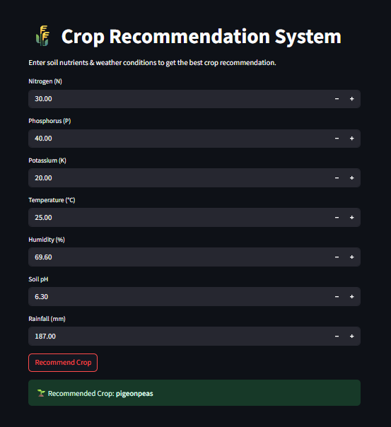

# 🌾 Data-Driven Crop Recommendation Model

##  Objective

This project presents a **machine learning-based crop recommendation system** that predicts the most suitable crop based on soil nutrients and weather conditions. The model is deployed using **Streamlit** for easy local use.

---

##  Problem Statement

Farmers often face difficulty choosing the right crop based on soil and climate. This project helps solve that problem using a trained ML model that takes input parameters like nitrogen, phosphorus, potassium, temperature, humidity, pH, and rainfall to suggest the best crop.

---

## Features

- Trained Random Forest machine learning model
- Input interface for farmers via Streamlit
- Instant crop recommendation
-  Local deployment using Python
-  Lightweight and beginner-friendly

---

## Project Structure
cropapp/
│
├── app.py # Streamlit application
├── requirements.txt # Python dependencies
├── crop_model.pkl # Trained ML model
├── scaler.pkl # Scaler used during training
├── label_encoder.pkl # Label encoder for crops
├── feature_order.pkl # List of feature column order
├── streamlit_app.png # Screenshot of app interface

---


---

## 💻 How It Works

1. User enters soil and environmental details.
2. Model processes inputs and returns a crop recommendation.
3. Built using a trained model, deployed with Streamlit for easy use.

---

## 📸 Screenshot



---

## ⚙️ Technologies Used

- Python
- Streamlit
- Pandas, NumPy
- Scikit-learn
- Joblib

---

## 🛠️ Installation & Run Locally

1. **Clone the repository**
   ```bash
   git clone https://github.com/yourusername/crop-recommendation-app.git
   cd crop-recommendation-app
2. **Install dependencies**
pip install -r requirements.txt
3. **Run the app**
streamlit run app.py

---

## **Conclusion**
The Data-Driven Crop Recommendation Model empowers farmers with intelligent crop choices. This project showcases the power of machine learning and Streamlit for real-world agricultural applications.

## **Author**


